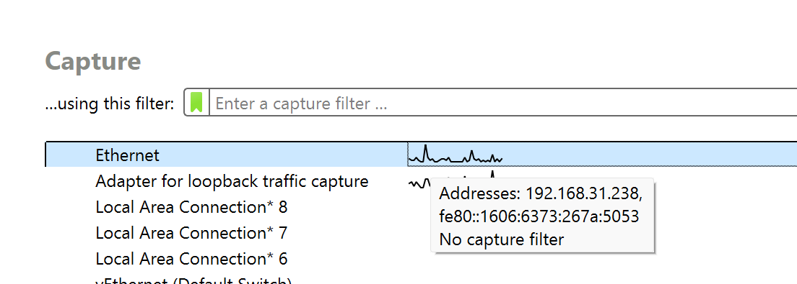
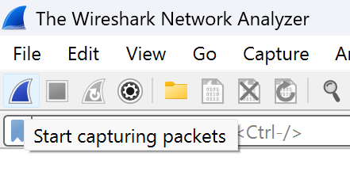
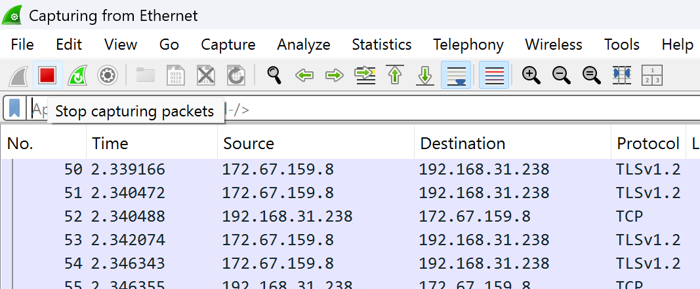
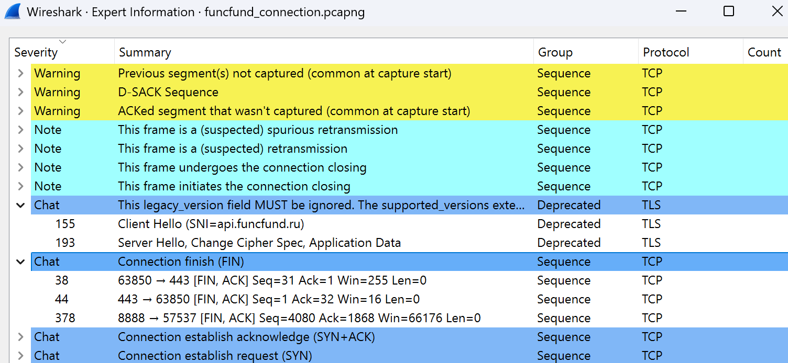

# Домашнее задание 

1. Установил инструмент WireShark по <a href="https://www.wireshark.org/download.html">ссылке</a>.
2. Начал перехватывать трафик, нажав на _start capturing packets_, выбрав _Ethernet_

3. Посетил собственный web-ресурс - <a href="funcfund.ru">funcfund.ru</a>
4. Нажав на _stop capturing packets_, получил _.pcapng_ файл

5. Немного изучил инструмент, меня заинтересовали кнопки анализа и статистики

